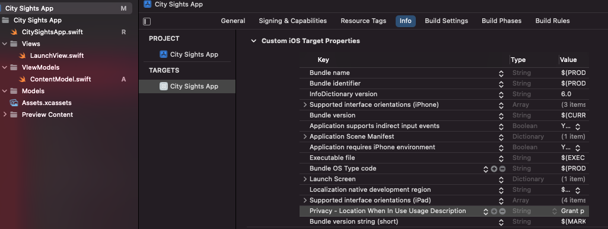
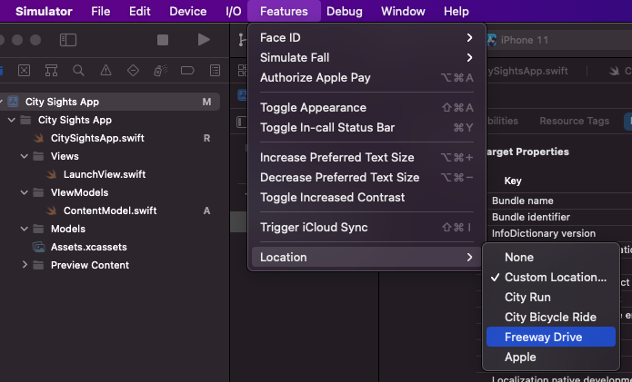
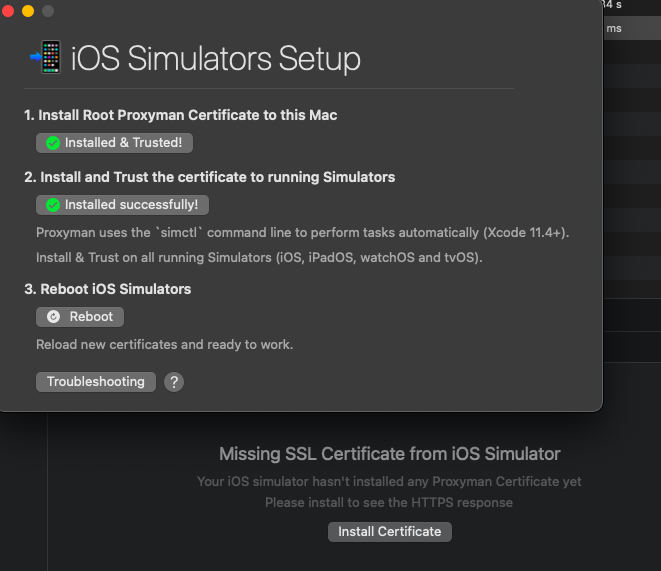
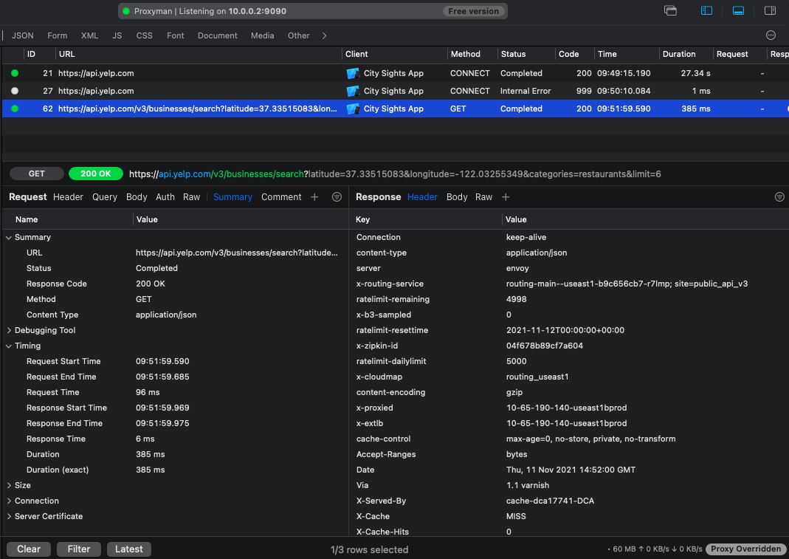
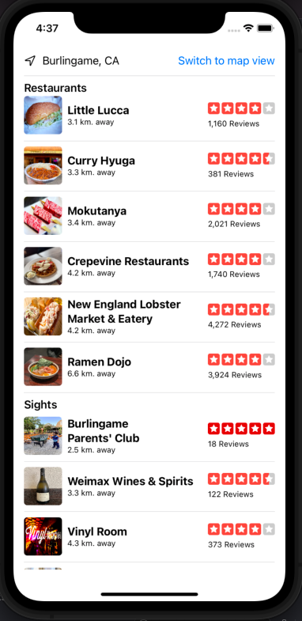

# City Sights App
This app displays the best restaurants near the current user based on the https://codewithchris.com iOS
 Foundations module 6.

It interacts with the Yelp API, as well as the CoreLocation framework to grab the user's location.

# Getting User Location
Add to the pslist, or the Info target tab a new key explaining the use of this information:
`Privacy - Location When In use ...`



You can set in the simulator a few locations to artificially display:


# Interacting with Yelp API
Anyone can sign up for a free API key for Yelp https://www.yelp.com/developers/documentation/v3/get_started.

## Keeping Credentials Secure
Setup your credentials in the `ProdEnv.swift` file. See `ProdEnvExample.swift` for exactly what you need to do. 

## Viewing web Request Details
There is an excellent tool that allows us to view the raw network traffic from the iOS Simulator, [Proxyman](http://proxyman.io).

Once downloaded, and installed, you should add Proxyman's root SSL certificate to your MacOS Trust Chain, so that it can decrypt HTTP
traffic. 

Make a web request with your iOS simulator. Then, Proxyman will detect this request, open the Apps window on the left to view this. 
From here, click your app. After this, click the request that Proxyman detected. You may have to run this request again for it to work. 
Then, click the install SSL Certificate button for the app. This certificate will last the duration of this particular iOS Simulator. So once
you destory this Simulator, you may need to repeat these steps:



After installing the certificate, restart your app, then make the request a final time. Click the latest request in Proxyman, it will show
you the raw headers used for your Simulator, the response returned from the API, the rate limit from the API (5000 daily requests for Yelp) 
and the time it took to grab the response along with much more data.




# App Design
## HomeView
This view displays a list of restaurants as well as sights in the area based on the closest distance to the user.




## Business Detail View
Shows details on the business itself, closed/ open, hours, phone, etc.

### Launching Other Apps
You can use one of the URLSchemes shown in the following document in order to open the phone, Messages,
Maps, or other app: https://developer.apple.com/documentation/swiftui/link.  

### DirectionsView
In a Link, we can open an Apple map by passing in one of these URL schemes:
 https://developer.apple.com/library/archive/featuredarticles/iPhoneURLScheme_Reference/MapLinks/MapLinks.html. 

For example, we use the one in this project for latitude/ longitude:
```
http://maps.apple.com/?ll=50.894967,4.341626
```

Meanwhile, if we want calculated directions we refer to the `MKDirections` class: 
https://developer.apple.com/documentation/mapkit/mkdirections.

## Launching the Settings from the app
You can make it, so the app opens the settings page.
```
/ Open settings
if let url = URL(string: UIApplication.openSettingsURLString) {

// Determines whether/ not it can open the URL
if UIApplication.shared.canOpenURL(url) {
    // Open the URL 
    UIApplication.shared.open(url)
}
```
